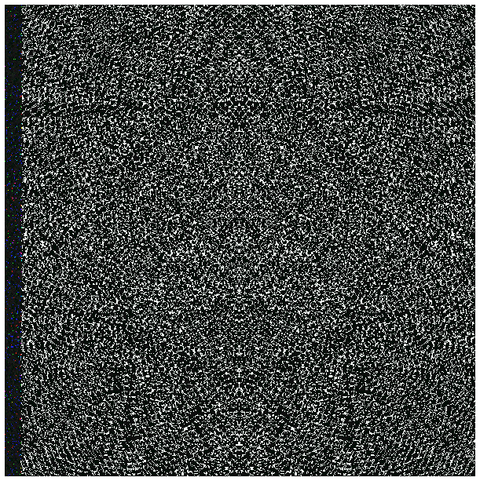

# Septem Attack
Work on attacking the Septem cryptocurrency puzzle as described on [this Reddit thread](https://www.reddit.com/r/bitcoinpuzzles/comments/n61a0a/the_bizarre_septem_puzzle/).


## Puzzle Overview
Septem is a cryptocurrency puzzle described in /r/bitcoinpuzzles, but allegedly originally published on 4Chan. The [PNG image](./wh8hlbzrsfx61.png) uses steganography to hide the puzzle description and the ciphertext. In broad strokes, it is a 7-layer deep nesting doll of encryption (each layer is XOR then Vigenere), each layer with a different key.

## Approach
Each nested layer has (English?) plaintext preceeding binary ciphertext. This plaintext is likely how one can reduce the search space for the XOR key + Vigenere key.

In general, the approach will be to find likely candidates for keys (look for patterns to guess the key period), limit our search space to BIP-39 wordlist matches, then try to parallelize the remaining search.


## Run the Code

Take a sample (first 140 bytes) of the chapter1 file and base64 encode it so it is safe to pass around as a CLI parameter:
```
$ cat ./chapter1 | head -c 140 | base64
```

This results in:
```
fmVPegksDjVqW39ZYVtpeA0sFCNKfnpeakB1QC8nFzVQfFd/b0hhVCwPIClfY1l9UXlxWy8ZJR94dEZySH1bfjEPNQd1WnlzQHhLaQk4MA1mQHxXfGBNaQEqET96UGBffEd0cgsmCjdZd39Ra1x5XjU1ASJLYEZsYToZMUpDe1I8fB5iNBAwNwBqf30=
```


## Data Files

### Chapter 1
[chapter 1 ciphertext](./chapter1)

### Initial Steganography results
[stegify-result.png](./stegify-result.png)

### BIP-39 words
[English BIP-39 words](./english.txt) gathered from [Bitcoin BIP-39](https://github.com/bitcoin/bips/blob/master/bip-0039/english.txt)

### wh8hlbzrsfx61.png


### ihKnTsY.png



## Tools and Reference

### Steganography
- [Stegify](https://github.com/DimitarPetrov/stegify)

### Decryption
- XOR Brute Force
- Vigenere Decryption

### Statistical Analysis
- [Incidence of Coincidence](http://practicalcryptography.com/cryptanalysis/text-characterisation/index-coincidence/)
- [Vigenere Cryptanalysis](http://practicalcryptography.com/cryptanalysis/stochastic-searching/cryptanalysis-vigenere-cipher/)

